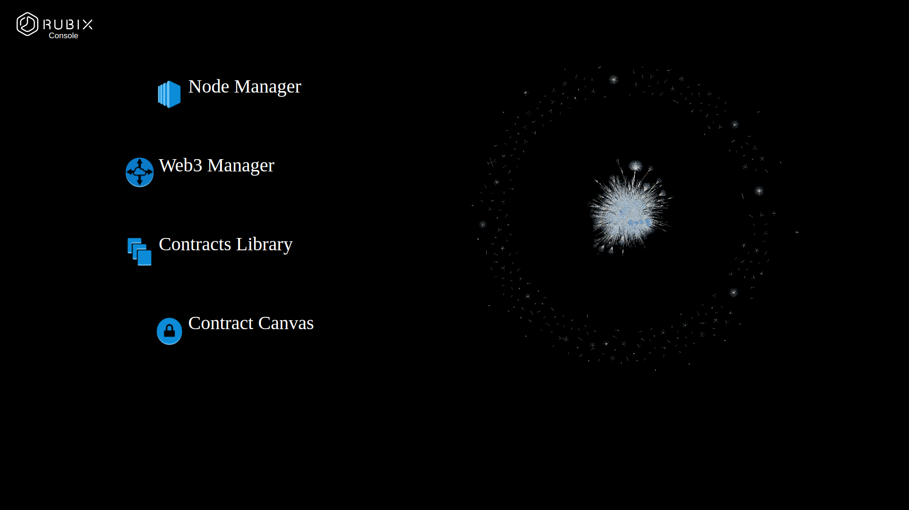

**Warning**  This is a work in progress. Do not use this for anything important.


# Quick-Start

```
$ [sudo] GIT_ASKPASS=1 npm install -g https://github.com/rubixbydeloitte/rubix-dev-ui
$ rubix-dev-ui [--server]
```

The flag `--server` will start the optional server in `rubix-sdk`, exposing an API specified [here](https://github.com/rubixbydeloitte/rubix-sdk#managementAPI)

# Rubix Develoment UI

This provides a graphical interface to the [rubix-sdk](https://github.com/rubixbydeloitte/rubix-sdk). It is recommended to start there with `rubix console` before using the development UI. 

The components `contracts` and `transactions` therein work in the browser directly, while the `nodes`
module provides an optional server to expose a management API.

This exposes functions to control nodes through Node.js wrappers utilizing the `child_process`
module. The risks of managing funds, sensitive data, or processes, should be evaluated critically
before exposing any of these functions. 


#### Features

* Start, stop, and configure nodes in 1 click
* Supports Ethereum, IPFS, and Bitcoin
* Completely in your control. Not a third-party API.
* Live reloading of smart contracts written and deployed locally
* Visualize transaction data



